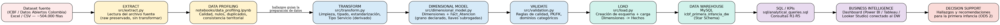
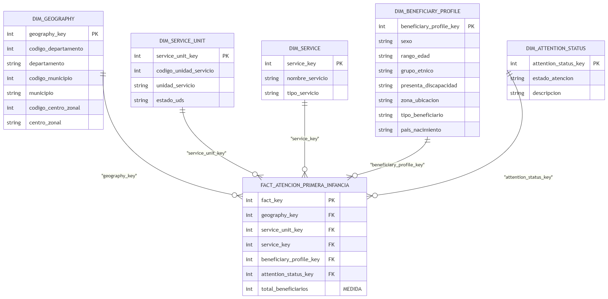

# Distribución territorial y caracterización de la primera infancia atendida por el ICBF en Colombia

**Curso:** ETL (G01) — Ingeniería de Datos e Inteligencia Artificial
**Fase 1:** De los requerimientos analíticos a un Data Warehouse dimensional
**ODS seleccionado:** ODS 2 — Hambre Cero

---

## Tabla de contenido

1. [Problema colombiano](#1-problema-colombiano)
2. [Objetivo analítico y requerimientos (R1–R5)](#2-objetivo-analítico-y-requerimientos-r1r5)
3. [Alineación con el ODS](#3-alineación-con-el-ods)
4. [Fuente de datos](#4-fuente-de-datos)
5. [Evaluación de idoneidad del dataset](#5-evaluación-de-idoneidad-del-dataset)
6. [Perfilamiento y calidad de datos](#6-perfilamiento-y-calidad-de-datos)
7. [Trazabilidad requerimientos → datos](#7-trazabilidad-requerimientos--datos)
8. [Estrategia de preparación de datos](#8-estrategia-de-preparación-de-datos)
9. [Arquitectura del sistema y grano declarado](#9-arquitectura-del-sistema-y-grano-declarado)
10. [Modelo dimensional (Star Schema)](#10-modelo-dimensional-star-schema)
11. [Trazabilidad requerimientos → modelo](#11-trazabilidad-requerimientos--modelo)
12. [Pipeline ETL](#12-pipeline-etl)
13. [Data Warehouse](#13-data-warehouse)
14. [Consultas analíticas y KPIs](#14-consultas-analíticas-y-kpis)
15. [Business Intelligence](#15-business-intelligence)
16. [Interpretación analítica — hallazgos](#16-interpretación-analítica--hallazgos)
17. [Limitaciones y supuestos](#17-limitaciones-y-supuestos)
18. [Cómo reproducir el proyecto](#18-cómo-reproducir-el-proyecto)
19. [Estructura del repositorio](#19-estructura-del-repositorio)
20. [Equipo y responsabilidades](#20-equipo-y-responsabilidades)

---

## 1. Problema colombiano

Colombia presenta una alta heterogeneidad territorial en la distribución de la población y de
los servicios dirigidos a la primera infancia. El gran volumen de beneficiarios y su dispersión
entre departamentos, municipios y unidades de servicio dificulta identificar patrones
territoriales y características de la población infantil atendida por el Instituto Colombiano de
Bienestar Familiar (ICBF). Esta situación limita la generación de información analítica que
permita reconocer concentraciones, diferencias y posibles situaciones de vulnerabilidad
relevantes para la planificación y la toma de decisiones relacionadas con la primera infancia y
el ODS 2 (Hambre Cero).

| Elemento | Descripción |
|---|---|
| **ODS** | ODS 2 — Hambre Cero |
| **Metas relacionadas** | Meta 2.1 (acceso a alimentación sana, nutritiva y suficiente, con énfasis en población vulnerable) y Meta 2.2 (fin a todas las formas de malnutrición infantil) |
| **Contexto colombiano** | El ICBF es la entidad rectora de la protección integral de la primera infancia en Colombia. Varias de sus modalidades de atención (HCB, HCB FAMI, MAI) incluyen componentes de alimentación y complemento nutricional |
| **Alcance geográfico** | Nacional — 32 departamentos + Bogotá D.C. |
| **Población / fenómeno de interés** | Beneficiarios de primera infancia atendidos por las modalidades del ICBF |
| **Enunciado del problema** | Analizar la distribución territorial y las características de la población infantil atendida por el ICBF en los departamentos y municipios de Colombia, para identificar patrones de concentración, diferencias territoriales y posibles contextos de vulnerabilidad |
| **Interesados (stakeholders)** | ICBF (planificación y focalización de recursos), Ministerio de Salud y Protección Social, gobernaciones y alcaldías, organismos de cooperación y ONG enfocadas en primera infancia, investigadores en política social |
| **Relevancia para la toma de decisiones** | Permite priorizar territorios y perfiles poblacionales para la asignación de recursos y el diseño de programas diferenciados en primera infancia |

## 2. Objetivo analítico y requerimientos (R1–R5)

**Objetivo analítico:** Analizar la distribución territorial y las características de la población
infantil atendida por el ICBF en los departamentos y municipios de Colombia, con el propósito de
identificar patrones de concentración, diferencias territoriales y posibles contextos de
vulnerabilidad que puedan aportar a la planificación de acciones relacionadas con la primera
infancia y el ODS 2.

| ID | Requerimiento analítico | Pregunta de negocio | Decisión / insight soportado |
|---|---|---|---|
| **R1** | Analizar la distribución territorial de beneficiarios de primera infancia entre departamentos de Colombia | ¿Qué departamentos concentran mayor número de beneficiarios atendidos por el ICBF? | Priorizar seguimiento y asignación de recursos en departamentos de alta concentración |
| **R2** | Identificar los municipios con mayor concentración de beneficiarios dentro de los departamentos más críticos | ¿Qué municipios específicos requieren mayor atención dentro de un departamento? | Focalizar intervenciones a escala municipal, no solo departamental |
| **R3** | Analizar qué tipos de servicio concentran mayor número de beneficiarios y cómo varían entre departamentos | ¿Qué modalidades de atención tienen mayor cobertura, y en qué territorios? | Evaluar si la oferta de servicios responde a las necesidades particulares de cada territorio |
| **R4** | Caracterizar la población infantil atendida según variables demográficas (sexo, edad, etnia, discapacidad) | ¿Qué perfiles poblacionales predominan entre los beneficiarios atendidos? | Diseñar programas diferenciados según las características de la población atendida |
| **R5** | Cruzar la distribución territorial con las características poblacionales, para identificar concentraciones de vulnerabilidad interseccional | ¿En qué territorios se concentran beneficiarios con mayores factores de vulnerabilidad (etnia, discapacidad, zona rural)? | Identificar zonas prioritarias donde la vulnerabilidad territorial y poblacional coinciden |

## 3. Alineación con el ODS

**ODS seleccionado:** ODS 2 — Hambre Cero
**Metas relacionadas:** Meta 2.1 y Meta 2.2.

Este proyecto **no reproduce un indicador oficial del ODS 2**, ya que el dataset —Caracterización
de Beneficiarios de las Modalidades de Primera Infancia del ICBF— no mide directamente
prevalencia de hambre, inseguridad alimentaria o desnutrición. Sin embargo, existe una relación
clara entre el problema analizado y la meta de Hambre Cero:

- El ICBF es la entidad rectora en Colombia de la protección integral de la primera infancia, y
  varias de sus modalidades —particularmente Hogar Comunitario de Bienestar (HCB), HCB FAMI
  (dirigida a gestantes, lactantes y menores de 2 años) y programas territoriales especiales como
  MAI-La Guajira— incluyen componentes explícitos de alimentación y complemento nutricional. La
  cobertura y distribución territorial de la atención del ICBF funciona, entonces, como un
  **proxy indirecto** del acceso a mecanismos de seguridad alimentaria en primera infancia.
- El perfilamiento de datos confirma esta relación: **La Guajira concentra el 15,95 %** de los
  beneficiarios atendidos a nivel nacional, muy por encima de cualquier otro departamento (el
  segundo lugar, Antioquia, alcanza apenas el 7,91 %), y es también el territorio con mayor
  número de beneficiarios indígenas. Esto es coherente con la crisis de desnutrición infantil
  ampliamente documentada en La Guajira, lo que sugiere que el ICBF ha priorizado ese territorio.
- **R1–R2** (distribución territorial y municipal) identifican dónde se concentra la atención
  institucional. **R3** (tipo de servicio) diferencia qué modalidades —incluidas las de
  componente nutricional explícito— predominan en cada territorio. **R4–R5** (caracterización
  poblacional y vulnerabilidad interseccional) permiten evaluar si la atención llega
  proporcionalmente a los grupos de mayor riesgo (indígenas, personas con discapacidad, zonas
  rurales), históricamente con más barreras de acceso a la seguridad alimentaria.

**Limitación reconocida:** el dataset no incluye indicadores directos de estado nutricional
(peso/talla, prevalencia de desnutrición aguda o crónica, inseguridad alimentaria del hogar). Los
hallazgos de este proyecto deben interpretarse como evidencia de **cobertura y distribución de la
atención institucional**, no como una medición directa del estado de hambre o nutrición de la
población.

## 4. Fuente de datos

| Campo | Valor |
|---|---|
| **Institución / dueño del dato** | Instituto Colombiano de Bienestar Familiar (ICBF), Bogotá D.C. |
| **Nombre del dataset** | Caracterización de Beneficiarios de las Modalidades de Primera Infancia |
| **URL / mecanismo de acceso** | https://www.datos.gov.co/Inclusi-n-Social-y-Reconciliaci-n/Caracterizaci-n-de-Beneficiarios-de-las-Modalidade/5akr-u7t8/about_data |
| **Formato** | Excel (`.xlsx`), exportable también a CSV |
| **Registros** | ~503.755 filas |
| **Atributos** | 21 columnas |
| **Cobertura geográfica** | Nacional (departamentos, municipios, centros zonales) |
| **Cobertura temporal** | Corte de extracción: 28 de agosto de 2026. El campo `Vigencia` solo contiene el valor 2025 (no hay serie histórica) |

### Instrucciones de adquisición (dataset no versionado en el repositorio)

Por el tamaño del archivo fuente (~40–130 MB según formato), **no se incluye en este
repositorio**. Para reproducir el proyecto:

1. Ingresar a la URL del dataset indicada arriba.
2. Exportar/descargar el archivo en formato Excel (`.xlsx`) o CSV.
3. Guardar el archivo como `data/raw/DatasetCompleto.xlsx` (o `.csv`) dentro de este repositorio,
   respetando exactamente ese nombre y ruta (usados por `src/extract.py`).

## 5. Evaluación de idoneidad del dataset

| Criterio | Evaluación |
|---|---|
| **Institución / dueño del dato** | ICBF, Bogotá D.C. |
| **URL / mecanismo de acceso** | Ver sección 4 |
| **Formato** | Excel |
| **Número de registros** | ~503.755 |
| **Número de atributos** | 21 |
| **Cobertura geográfica** | Nacional |
| **Cobertura temporal** | Corte único (28 ago. 2026), campo `Vigencia` = 2025 |
| **Medidas numéricas relevantes** | `Beneficiarios` (conteo agregado de beneficiarios por combinación de atributos) |
| **Atributos categóricos relevantes** | Departamento, Municipio, Centro Zonal, Nombre Servicio, Estado UDS, Tipo de Beneficiario, Sexo, Rango Edad, Grupo Étnico, Presenta Discapacidad, Zona Ubicación Beneficiario, País Nacimiento, Estado Atención |
| **Problemas de calidad detectados** | Alto porcentaje de nulos en `Modalidad` (~64 %); ~285 posibles registros duplicados considerando todas las características; nulos puntuales en `Zona Ubicación Beneficiario`, `País Nacimiento` y `Rango Edad` |
| **Relación con los requerimientos analíticos** | El dataset permite analizar distribución territorial (R1–R2), caracterizar la población por variables demográficas (R4), analizar tipos de servicio (R3) y cruzar territorio con vulnerabilidad (R5) |
| **Idoneidad para modelado dimensional** | Alta: contiene una medida principal (`Beneficiarios`) y múltiples atributos descriptivos organizables en dimensiones de geografía, unidad de servicio, servicio y perfil del beneficiario |
| **Unidad de observación en la fuente** | Cada registro representa una agrupación de beneficiarios que comparte una combinación determinada de atributos territoriales, de servicio y de caracterización; `Beneficiarios` indica la cantidad asociada a esa combinación |

## 6. Perfilamiento y calidad de datos

El perfilamiento completo, ejecutado por lotes sobre el archivo fuente para controlar el uso de
memoria, está documentado en [`notebooks/profile.py`](notebooks/profile.py).
Principales hallazgos:

- **Volumen:** ~503.755 registros, 21 columnas.
- **Consistencia territorial:** 0 inconsistencias entre código y nombre de departamento (cada
  código mapea a un único nombre).
- **Nulos:** `Modalidad` presenta ~64 % de valores nulos y se descarta como variable analítica
  principal. `Zona Ubicación Beneficiario`, `País Nacimiento` y `Rango Edad` presentan nulos
  puntuales.
- **Duplicados:** existen duplicados exactos al considerar el grano completo (todas las
  características), consistentes con el hecho de que cada fila representa una **agregación** de
  beneficiarios y no un evento individual.
- **Cardinalidad:** `Nombre Servicio` tiene ~28-29 categorías sin nulos (variable confiable para
  tipo de servicio); `Estado UDS` solo tiene 2 valores limpios (`ACTIVA` / `INACTIVA`).
- **Estado Atención:** el origen mezcla codificaciones `1`/`2` con `A`/`I`, que se normalizan a un
  único dominio `{A, I}`.
- **Rango numérico:** `Beneficiarios` no presenta valores negativos ni nulos.

## 7. Trazabilidad requerimientos → datos

| Requerimiento | Atributos requeridos | Transformación necesaria | KPI / análisis esperado |
|---|---|---|---|
| **R1** | Departamento UDS, Código Departamento UDS, Beneficiarios | Agregar (`SUM`) Beneficiarios agrupando por Departamento; validar consistencia código↔nombre (sin inconsistencias) | Total y % de beneficiarios por departamento; ranking de concentración |
| **R2** | Municipio UDS, Código Municipio UDS, Departamento UDS, Beneficiarios | Agregar (`SUM`) por Municipio dentro de Departamento; estandarizar nombres de municipio | Top N municipios por beneficiarios dentro de los departamentos priorizados en R1 |
| **R3** | Nombre Servicio, Departamento UDS, Beneficiarios | Derivar `Tipo Servicio` a partir de `Nombre Servicio` (se descarta `Modalidad` por alta nulidad) | Distribución de beneficiarios por tipo de servicio y por departamento |
| **R4** | Sexo, Rango Edad, Grupo Étnico, Presenta Discapacidad, Beneficiarios | Estandarizar categorías (mayúsculas, sin espacios extra); imputar nulos puntuales como `SIN INFORMACIÓN` | Distribución porcentual por sexo, edad, etnia y discapacidad |
| **R5** | Departamento UDS, Grupo Étnico, Presenta Discapacidad, Zona Ubicación Beneficiario, Beneficiarios | Construir tabla cruzada territorio × característica de vulnerabilidad | Ranking de departamentos con mayor concentración de beneficiarios en categorías de vulnerabilidad |

## 8. Estrategia de preparación de datos

Implementada en [`src/transform.py`](src/transform.py):

1. **Tipado de identificadores:** los códigos territoriales (`Codigo Departamento/Municipio/
   CentroZonal/Unidad Servicio UDS`) y `Vigencia` se convierten a enteros (`Int64`).
2. **Validación de la medida:** `Beneficiarios` se valida como numérica, sin negativos ni nulos, y
   se castea a entero.
3. **Estandarización categórica:** todas las columnas categóricas se recortan (`strip`), se
   colapsan espacios múltiples y se convierten a mayúsculas, para evitar duplicados lógicos por
   diferencias de formato.
4. **Normalización de `Estado Atención`:** se mapean las codificaciones `1`→`A` y `2`→`I`
   (conservando `A`/`I` cuando ya vienen así), y se valida que no existan categorías inesperadas.
5. **Manejo de nulos como categoría explícita:** `Zona Ubicación Beneficiario`, `País Nacimiento`
   y `Rango Edad` faltantes se imputan como `"SIN INFORMACIÓN"` (se conservan como categoría
   analítica en vez de eliminarse, para no perder registros).
6. **`Modalidad` no se imputa:** por su alta proporción de nulos (~64 %) y porque no se usará como
   variable analítica principal; se conserva en el dataset crudo para trazabilidad, pero se excluye
   del dataset definitivo.
7. **Atributo derivado justificado — `Tipo Servicio`:** requerido por R3. Se deriva de `Nombre
   Servicio` mediante reglas de clasificación (HCB, MAI, Centro de Desarrollo Infantil, Jardín,
   Educación Inicial, Semillas de Vida, Servicio Propio, Otros), porque `Modalidad` no es
   suficientemente confiable.
8. **Tipos categóricos:** las columnas categóricas finales se convierten a `category` para
   reducir memoria y dejar explícita su naturaleza.
9. **Selección del dataset definitivo:** se conserva únicamente el subconjunto de columnas
   necesario para el modelo dimensional y los requerimientos R1–R5.

No todos los problemas detectados se modifican: cada decisión de preparación está justificada por
su impacto en los requerimientos analíticos y el modelo dimensional (por ejemplo, `Modalidad` se
conserva sin imputar porque no se usa en el análisis).

## 9. Arquitectura del sistema y grano declarado

```
Dataset fuente (ICBF)
        │
        ▼
  EXTRACT  (src/extract.py)
        │
        ▼
  DATA PROFILING  (notebooks/profile.py)
        │
        ▼
  TRANSFORM — preparación de datos  (src/transform.py)
        │
        ▼
  TRANSFORM — modelo dimensional  (src/dimensional_model.py)
        │
        ▼
  VALIDATE  (src/validation.py)
        │
        ▼
  LOAD  (src/load.py)  →  Data Warehouse MySQL (Star Schema)
        │
        ▼
  SQL / KPIs  (sql/analytical_queries.sql)
        │
        ▼
  Business Intelligence (dashboard conectado al DW)
        │
        ▼
  Decision Support — hallazgos para primera infancia / ODS 2
```



**Grano declarado:**

> Cada fila en `Fact_Atencion` representa el total de beneficiarios (`total_beneficiarios`) que
> comparten exactamente la misma combinación de: geografía (departamento, municipio, centro
> zonal), unidad de servicio, servicio (nombre y tipo), perfil del beneficiario (sexo, rango de
> edad, grupo étnico, discapacidad, zona, tipo de beneficiario, país de nacimiento) y estado de
> atención.

Este grano es coherente con la unidad de observación de la fuente: el dataset original ya entrega
`Beneficiarios` como un conteo agregado por combinación de atributos, por lo que el ETL colapsa
(`SUM`) cualquier duplicado exacto de esa combinación al construir la tabla de hechos.

## 10. Modelo dimensional (Star Schema)



| Dimensión | Atributos | Justificación analítica |
|---|---|---|
| **Dim_Geography** | Departamento, Municipio, Centro Zonal (jerarquía) | Sin inconsistencias código↔nombre; jerarquía clara Departamento → Municipio → Centro Zonal; soporta R1, R2 y R5 |
| **Dim_Service_Unit** | Código Unidad de Servicio, Nombre, Estado UDS | Identifica el punto de atención específico; `Estado UDS` solo tiene 2 valores limpios |
| **Dim_Service** | Nombre Servicio, Tipo Servicio (derivado) | Variable confiable para el tipo de programa (28–29 categorías, sin nulos), a diferencia de `Modalidad`; soporta R3 |
| **Dim_Beneficiary_Profile** *(junk dimension)* | Sexo, Rango Edad, Grupo Étnico, Presenta Discapacidad, Zona Ubicación, Tipo de Beneficiario, País Nacimiento | Agrupa atributos categóricos de baja cardinalidad en una sola dimensión, evitando siete tablas pequeñas separadas; soporta R4 y R5 |
| **Dim_Attention_Status** | Estado Atención (A/I), Descripción | Se mantiene separada por tener un significado de negocio propio (activo/inactivo) e independiente de las demás dimensiones |

No se creó una dimensión de tiempo completa: el campo `Vigencia` es prácticamente degenerado (un
único valor, 2025) en esta entrega, por lo que no aporta una jerarquía temporal real; se documenta
como limitación en la sección 17.

**Tabla de hechos — `Fact_Atencion`:**

- Llave primaria subrogada `fact_key`.
- Llaves foráneas hacia las 5 dimensiones (`geography_key`, `service_unit_key`, `service_key`,
  `beneficiary_profile_key`, `attention_status_key`).
- Medida: `total_beneficiarios` (`SUM` de `Beneficiarios` agrupado por el grano declarado).

Cada dimensión, hecho y atributo tiene una justificación analítica explícita ligada a R1–R5; no se
crearon dimensiones solo porque existieran columnas categóricas en el dataset fuente.

## 11. Trazabilidad requerimientos → modelo

| Requerimiento | Dimensión(es) | Medida(s) | Consulta / KPI esperado | ¿Soportado? |
|---|---|---|---|---|
| R1 | Dim_Geography (nivel Departamento) | SUM(total_beneficiarios) | Total y % de beneficiarios por departamento, orden descendente | Sí |
| R2 | Dim_Geography (nivel Municipio, dentro de Departamento) | SUM(total_beneficiarios) | Top N municipios por beneficiarios, agrupado por departamento | Sí |
| R3 | Dim_Service, Dim_Geography (Departamento) | SUM(total_beneficiarios) | Distribución por tipo de servicio, cruzada con departamento | Sí |
| R4 | Dim_Beneficiary_Profile (Sexo, Rango Edad, Grupo Étnico, Discapacidad) | SUM(total_beneficiarios), COUNT | Distribución porcentual por cada atributo demográfico | Sí |
| R5 | Dim_Geography (Departamento), Dim_Beneficiary_Profile (Grupo Étnico, Discapacidad, Zona) | SUM(total_beneficiarios) | Tabla cruzada Departamento × características de vulnerabilidad | Sí |

## 12. Pipeline ETL

Implementado en Python bajo `src/`, con responsabilidades claramente separadas y orquestado por
[`src/main.py`](src/main.py):

| Etapa | Módulo | Responsabilidad |
|---|---|---|
| **Extract** | `extract.py` | Lee el archivo fuente (Excel, motor `calamine` con respaldo `openpyxl`), sin aplicar transformaciones de negocio |
| **Transform — preparación** | `transform.py` | Tipado, estandarización, normalización de categorías, manejo de nulos, atributo derivado `Tipo Servicio` |
| **Transform — modelo dimensional** | `dimensional_model.py` | Construcción de las 5 dimensiones (con llaves subrogadas) y de `Fact_Atencion` (agregación `SUM` por el grano declarado) |
| **Validate** | `validation.py` | Validación estructural (columnas, filas vacías), tipos de dato, dominios categóricos válidos, nulos en identificadores, rangos positivos y consistencia código↔nombre territorial |
| **Load** | `load.py` | Crea el esquema del Data Warehouse (`sql/create_dw.sql`), vacía las tablas (`TRUNCATE`) para permitir reejecuciones, y carga primero las dimensiones y luego los hechos |

El pipeline es **reproducible**: cada ejecución de `main.py` vuelve a extraer, transformar, validar
y cargar el dataset completo, dejando además una copia de las tablas del modelo en
`data/processed/*.csv` para trazabilidad y auditoría.

## 13. Data Warehouse

- **Motor:** MySQL (`sql/create_dw.sql` define la base `icbf_primera_infancia_dw`, las 5 tablas de
  dimensión y `fact_atencion`, con llaves primarias autoincrementales y llaves foráneas explícitas).
- **Carga:** dimensiones primero, tabla de hechos después, respetando las restricciones de
  integridad referencial (`src/load.py`).
- **Configuración de conexión:** variables de entorno en `.env` (ver `.env.example`).

## 14. Consultas analíticas y KPIs

Implementadas en [`sql/analytical_queries.sql`](sql/analytical_queries.sql), todas contra el Data
Warehouse (no contra el archivo fuente ni DataFrames intermedios):

| Requerimiento | Consulta analítica | Métrica / KPI | Tablas del DW usadas | Resultado principal |
|---|---|---|---|---|
| R1 | Beneficiarios por departamento | Total y % de participación | `fact_atencion`, `dim_geography` | La Guajira concentra la mayor proporción de beneficiarios a nivel nacional (15,95 %), muy por encima de cualquier otro departamento |
| R2 | Top 5 municipios por departamento | Ranking dentro de cada departamento | `fact_atencion`, `dim_geography` | Dentro de La Guajira, Uribia, Manaure, Riohacha y Maicao son los municipios con mayor concentración |
| R3 | Beneficiarios por tipo de servicio (nacional y por departamento) | % de cobertura por modalidad | `fact_atencion`, `dim_service`, `dim_geography` | El tipo de servicio "MAI" (específico de La Guajira) representa una proporción significativa del total nacional, concentrado casi exclusivamente en ese departamento |
| R4 | Distribución por sexo, edad, etnia, discapacidad | % de participación por categoría demográfica | `fact_atencion`, `dim_beneficiary_profile` | El rango "6 meses - 5 años" concentra la mayoría de beneficiarios; la mayoría no se autorreconoce en ningún grupo étnico, seguida de población indígena |
| R5 | Índice de concentración de vulnerabilidad por departamento | % de beneficiarios indígenas / con discapacidad / zona rural sobre el total departamental | `fact_atencion`, `dim_beneficiary_profile`, `dim_geography` | La Guajira presenta la mayor concentración relativa de beneficiarios indígenas y en zona rural, señalándolo como territorio prioritario de vulnerabilidad interseccional |

## 15. Business Intelligence

## 15. Business Intelligence

El dashboard analítico fue construido en **Power BI Desktop**, conectado directamente 
al Data Warehouse en MySQL (`icbf_primera_infancia_dw`) mediante el conector nativo 
de MySQL — no se lee el archivo fuente en ningún momento.

**Archivo:** `docs/Dashboard.pbix`
**Evidencia visual:** `docs/dashboard.png`

### Estructura del dashboard (5 páginas)

| Página | Requerimiento(s) | Contenido |
|---|---|---|
| **Resumen Ejecutivo** | Contexto general | Tarjetas KPI: Total de Beneficiarios, Departamentos Atendidos, Municipios Atendidos, Unidades de Servicio |
| **Análisis Territorial** | R1, R2 | Distribución de beneficiarios por departamento; matriz con drill-down departamento → municipio |
| **Tipos de Servicio** | R3 | Ranking nacional de tipos de servicio; composición por departamento (Top 10, barras apiladas 100%) |
| **Caracterización Poblacional** | R4 | Distribución por sexo, rango de edad, grupo étnico y discapacidad |
| **Vulnerabilidad Territorial** | R5 | % de población indígena y % en zona rural, por departamento |

### KPIs y medidas (DAX)

- `Total Beneficiarios` — medida base, suma de la tabla de hechos.
- `% Indigena` y `% Zona Rural` — proporción de población vulnerable dentro de cada departamento (medidas con `ALLEXCEPT`, para calcular el porcentaje relativo al total departamental, no al total nacional).

### Filtros

Filtros transversales (aplican a las 5 páginas simultáneamente): departamento, tipo de servicio, sexo, rango de edad, grupo étnico, discapacidad y zona de ubicación.

### Análisis temporal — no aplicable

El dataset original solo contiene el valor `2025` en el campo `Vigencia` (confirmado 
en el perfilamiento, Sección 7), sin variabilidad temporal alguna. Por esta razón, 
`Vigencia` fue excluida del modelo dimensional (ver grano declarado, Sección 10) y 
el dashboard no incluye un componente de análisis temporal, en cumplimiento del 
criterio *"when applicable"* de los requisitos del proyecto.

### Nota de interpretación: proporción vs. volumen absoluto

En la página de Vulnerabilidad Territorial, los departamentos líderes en % de 
población indígena/rural (ej. Vaupés, San Andrés) no son necesariamente los mismos 
que lideran en volumen absoluto de beneficiarios (La Guajira). Esto se debe a que 
departamentos con menor población total atendida pueden tener una proporción interna 
más alta de un grupo específico, sin que eso implique mayor relevancia en términos 
de volumen poblacional. Ambas lecturas (proporcional y absoluta) se consideran 
complementarias, no contradictorias, para la toma de decisiones.

## 16. Interpretación analítica — hallazgos

**Hallazgo 1 — Concentración territorial extrema en La Guajira (R1)**
Los datos muestran que La Guajira concentra el 15,95 % de los beneficiarios de primera infancia
atendidos por el ICBF a nivel nacional, más del doble que el segundo departamento (Antioquia,
7,91 %). Este hallazgo responde directamente a R1 y es relevante en el contexto colombiano porque
La Guajira es una de las regiones con mayores índices de mortalidad infantil asociada a causas
nutricionales; la alta concentración de atención institucional sugiere que el ICBF ya ha
identificado este territorio como zona prioritaria, lo cual podría orientar decisiones futuras de
asignación de recursos y monitoreo específico.

**Hallazgo 2 — El tipo de servicio "MAI" es un programa casi exclusivo de La Guajira (R3)**
El análisis por tipo de servicio muestra que la modalidad MAI (Modelo de Atención Integral)
concentra una proporción significativa del total nacional de beneficiarios, casi en su totalidad
dentro de La Guajira. Esto responde a R3 y confirma que la oferta de servicios del ICBF sí se
diferencia territorialmente en función de las necesidades particulares de cada región,
sustentando decisiones sobre replicar o ajustar este tipo de programa en otros departamentos con
perfiles de vulnerabilidad similares.

**Hallazgo 3 — La vulnerabilidad interseccional se concentra en pocos departamentos (R5)**
El cruce territorio × características de vulnerabilidad (grupo étnico indígena, discapacidad,
zona rural) muestra que La Guajira presenta simultáneamente la mayor proporción relativa de
beneficiarios indígenas y en zona rural del país. Esto responde a R5 y es relevante porque permite
identificar zonas donde coinciden múltiples factores de riesgo, lo cual respalda una futura
investigación sobre si la cobertura actual del ICBF es proporcional a la magnitud de esa
vulnerabilidad interseccional, más allá del volumen total de beneficiarios.

## 17. Limitaciones y supuestos

- **Ausencia de serie temporal:** el campo `Vigencia` solo contiene un valor (2025) en esta
  entrega, por lo que no fue posible construir una dimensión de tiempo con jerarquía real
  (año/mes) ni analizar tendencias históricas.
- **`Modalidad` descartada:** se decidió no usar ni imputar la columna `Modalidad` por su alto
  porcentaje de nulos (~64 %); en su lugar se derivó `Tipo Servicio` a partir de `Nombre Servicio`,
  lo cual es una aproximación razonable pero no idéntica a la taxonomía oficial de modalidades del
  ICBF.
- **Proxy indirecto del ODS 2:** el dataset no mide directamente hambre, inseguridad alimentaria
  ni desnutrición; los hallazgos deben interpretarse como evidencia de cobertura institucional, no
  como medición nutricional directa (ver sección 3).
- **Duplicados por grano:** algunos registros comparten exactamente la misma combinación de
  atributos del grano declarado; se asume que estos representan conteos legítimos que deben
  sumarse (`SUM`), no errores de captura, siguiendo el mismo criterio con que el dataset fuente ya
  entrega `Beneficiarios` como una cifra agregada.
- **BI pendiente:** al momento de esta entrega, el dashboard de Business Intelligence conectado al
  Data Warehouse aún no ha sido construido/documentado (ver sección 15).

## 18. Cómo reproducir el proyecto

### Requisitos previos

- Python 3.11+
- MySQL Server en ejecución (local o remoto)
- El archivo fuente descargado según la sección 4

### Pasos

```bash
# 1. Clonar el repositorio
git clone <URL_DEL_REPOSITORIO>
cd etl-project-first-delivery

# 2. Crear y activar un entorno virtual (opcional pero recomendado)
python -m venv .venv
source .venv/bin/activate        # En Windows: .venv\Scripts\activate

# 3. Instalar dependencias
pip install -r requirements.txt

# 4. Configurar la conexión a la base de datos
cp .env.example .env
# Editar .env con las credenciales reales de tu servidor MySQL

# 5. Colocar el dataset fuente (ver sección 4)
# data/raw/DatasetCompleto.xlsx

# 6. Ejecutar el pipeline ETL completo
cd src
python main.py
```

El script `main.py` extrae, transforma, valida, construye el modelo dimensional, crea el esquema
en MySQL y carga dimensiones y hechos. Al finalizar, las tablas del modelo también quedan
respaldadas en `data/processed/*.csv`.

Para ejecutar el perfilamiento de datos (lee el CSV fuente por lotes e imprime el reporte
completo en consola):

```bash
cd notebooks
python profile.py
```

Para ejecutar las consultas analíticas directamente sobre MySQL:

```bash
mysql -u <usuario> -p icbf_primera_infancia_dw < sql/analytical_queries.sql
```

## 19. Estructura del repositorio

```
etl-project-first-delivery/
├── data/
│   ├── raw/              # Dataset fuente (no versionado, ver sección 4)
│   └── processed/        # Salidas del modelo dimensional (dimensiones + hechos)
├── notebooks/
│   └── profile.py
├── src/
│   ├── extract.py
│   ├── transform.py
│   ├── validation.py
│   ├── dimensional_model.py
│   ├── load.py
│   └── main.py
├── sql/
│   ├── create_dw.sql
│   └── analytical_queries.sql
├── docs/
│   ├── architecture.png
│   ├── star_schema.png
│   └── dashboard.pbix     
├── README.md
├── requirements.txt
├── .env.example
└── .gitignore
```


---

*Proyecto elaborado para el curso de ETL (G01) — Facultad de Ingeniería y Ciencias Básicas,
Universidad Autónoma de Occidente.*
